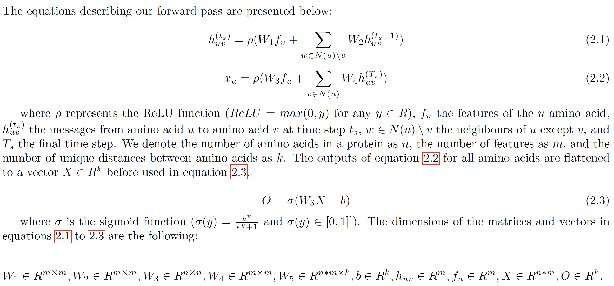

### Table of contents
- [1. Description](#1-description)
- [2. Model architecture](#2-model-architecture)
- [3. Build and use](#3-build-and-use)
- [4. Import and use](#4-import-as-package)
- [5. Examples](#5-examples)
- [6. Requirements](#6-requirements)
- [7. Environment](#7-environment)
- [8. Dataset](#8-dataset)
- [9. Environment variables](#9-environment-variables)
- [10. Execute a grid search](#10-execute-a-grid-search)
- [11. Execute an inference](#11-execute-an-inference)


### 1. Description

This repository contains:
1. A pytorch C++ implementation of a message passing neural network with RNN units (inspired from https://arxiv.org/abs/1812.01070). 
2. A python wrapper around the model to perform a grid search, and save model checkpoints for each validation step.
3. A script to perform an inference on a dataset based on a specific model checkpoint.
4. A custom CUDA kernel.

### 2. Model Architecture



### 3. Build and use

To use the current version (master or tag >= 1.5.0) you need to first build the project. Please clone the repository and then run the build scripts depending on your OS and whether you have a CUDA enabled GPU available. To build for GPU you first need to set the CUDA_HOME variable in the respective .sh file (here it defaults to usr/local/cuda).

Linux (CPU & GPU)
```
. linux_build.sh
```

Linux (CPU only)
```
. linux_build_cpu.sh
```

macOS (CPU & GPU)
```
. macos_build.sh
```

macOS (CPU only)
```
. macos_build_cpu.sh
```

Then you can use the code as in the [examples](#4-examples) or perform a [grid search](#9-execute-a-grid-search). 

### 4. Import as package
If you can't build the project you can install the pure python version of the project (version 1.4.2) using pip:

```
pip install message-passing-nn
```

### 5. Examples

The code can be used to either train a single configuration of the message passing neural network or to perform a grid search. For usage examples (v1.4.2) please look in the example_notebooks/ directory or on the [colab notebook](https://colab.research.google.com/drive/1jFJ7l7jIv22BhvvzlmXOWFtgBE15ea2X).

### 6. Requirements

Python 3.7.6

Run
```
click
torch=1.5.0
numpy==1.17.4
pandas=1.0.3
tqdm
```

Tests
```
numpy==1.17.4
torch=1.5.0
pandas=1.0.3
```

### 7. Environment
To create the "message-passing-neural-network" conda environment please run:

```
conda env create -f environment.yml
```

### 8. Dataset
      
The repository expects the data to be in the following format:

  - filenames: something_features.pickle, something_adjacency-matrix.pickle & something_labels.pickle
  - features: torch.tensor.Size([M,N])
  - adjacency-matrix: torch.tensor.Size([M,M])
  - labels: torch.tensor.Size([L])

**All features and labels should be preprocessed to be of the same size**
  
For example, in the protein-folding dataset:

  - M: represents the number of amino acids
  - N: represents the number of protein features
  - L: represents the number of values to predict

This repository contains two dataset folders with examples of data to run the code:

  - sample-dataset: Contains just one pair of features/labels with some default values. This data lets you run the code in demo mode.
  - protein-folding: Contains pairs of features/labels for various proteins (prepared using https://github.com/simonholmes001/structure_prediction). The features represent protein characteristics, and the labels the distance between all aminoacids.

### 9. Environment variables
      
The model and grid search can be set up using a set of environment variables contained in the grid-search-parameters.sh. Please refer to the ENVIRONMENT_VARIABLES.md for the full list of available environment variables and how to use them.

### 10. Execute a grid search
       
Before executing a grid-search please go to the grid-search.sh to add your PYTHONPATH=path/to/message-passing-nn/.

The grid search can be executed by executing a shell script:
```
. grid-search.sh
```

This script will:

1. Create the conda environment from the environment.yml (if not created already)
2. Activate it
3. Export the PYTHONPATH=path/to/message-passing-nn/ (line needs to be uncommented first)
4. Export the environment variables to be used for the Grid Search
5. Run the grid search
6. Save model checkpoints for each validation and a csv file containing all calculated losses

### 11. Execute an inference

Before executing an inference please go to the inference.sh to add your PYTHONPATH=path/to/message-passing-nn/. Please also make sure that the dataset used for inference is of same dimensions (M, N, L) as the one used to train the model.

The grid search can be executed by executing a shell script:
```
. grid-search.sh
```

This script will:

1. Create the conda environment from the environment.yml (if not created already)
2. Activate it
3. Export the PYTHONPATH=path/to/message-passing-nn/ (line needs to be uncommented first)
4. Export the environment variables to be used for the Inference
5. Run the inference
6. Save results as a list of (output, label, tag) for each input

